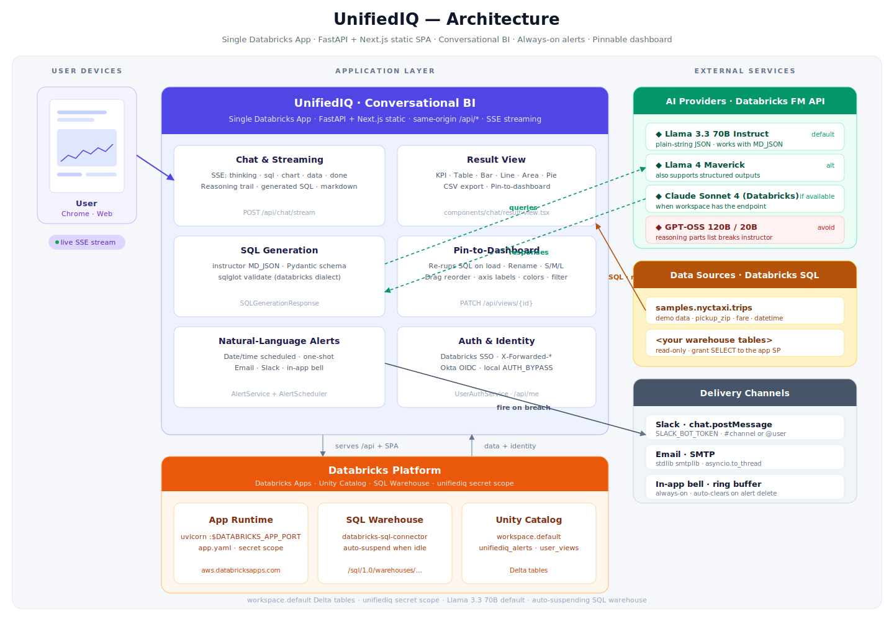
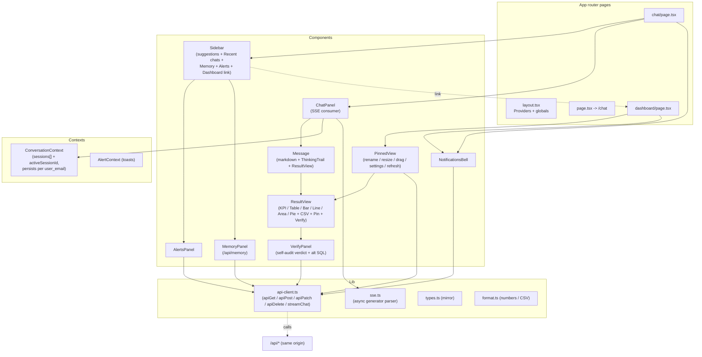
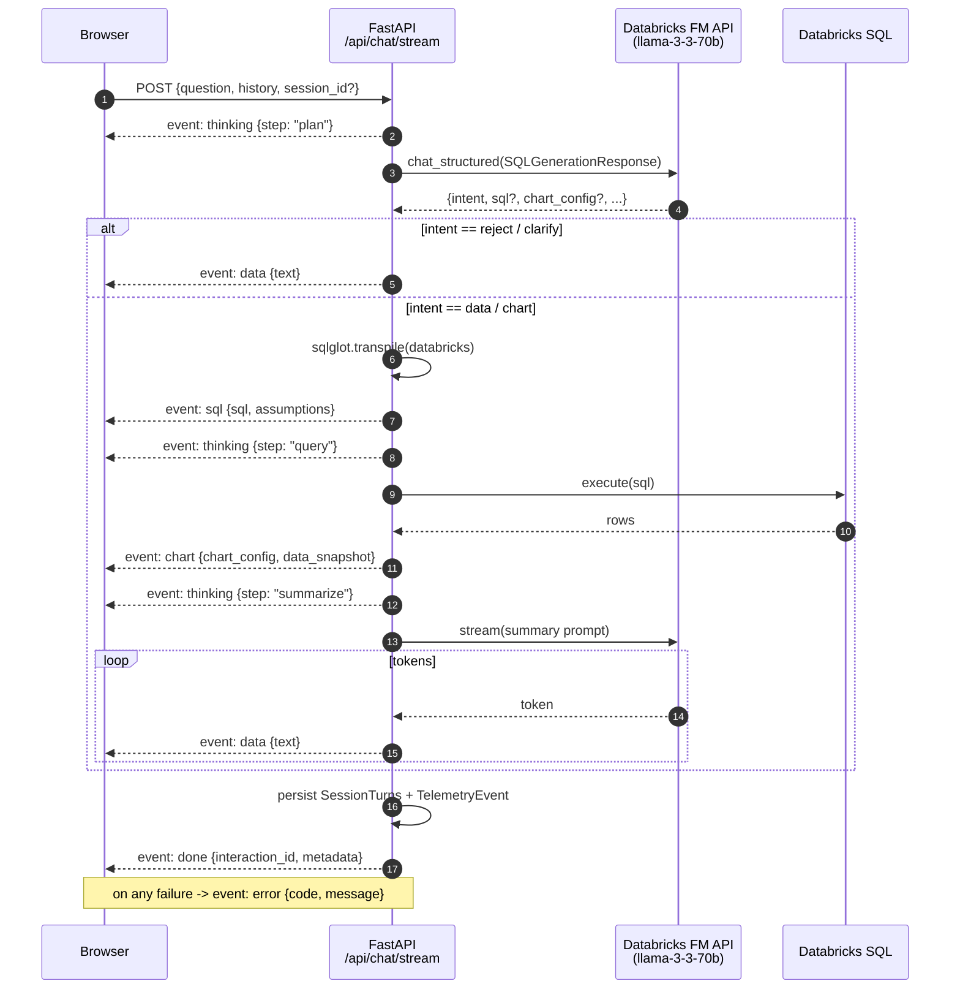
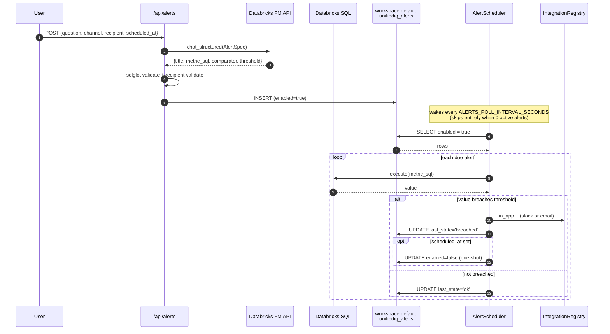
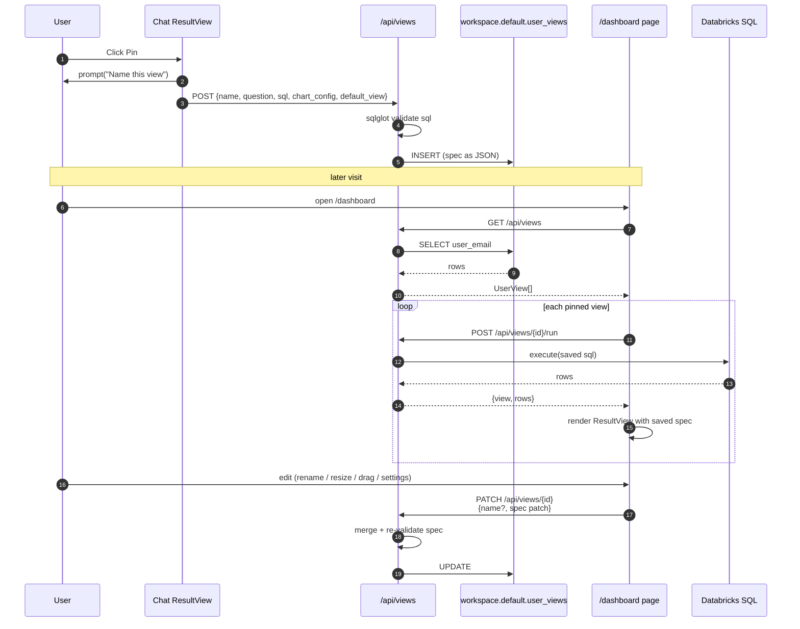
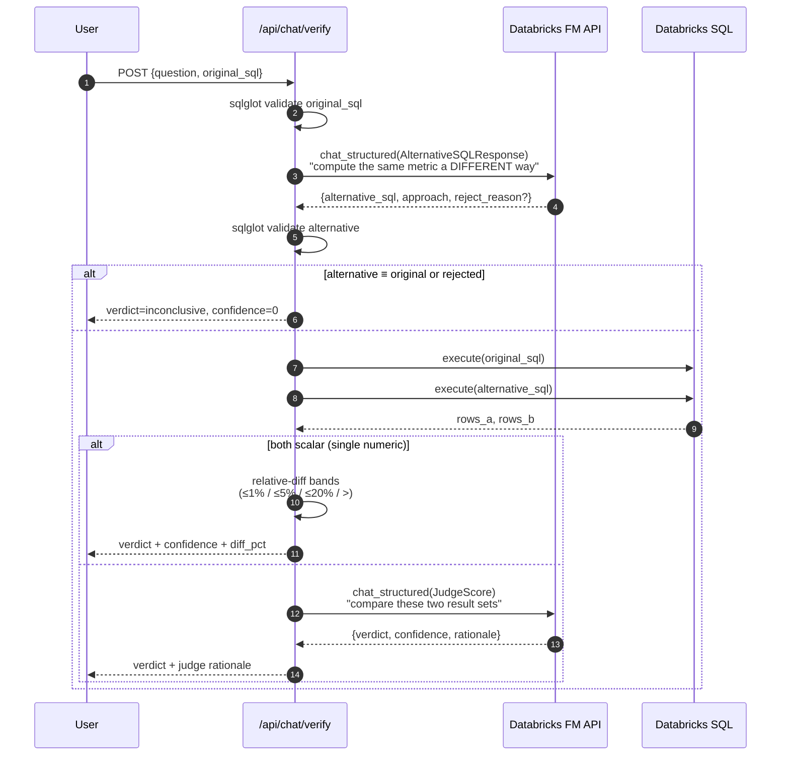
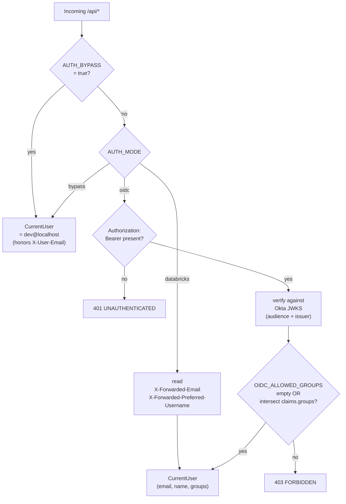
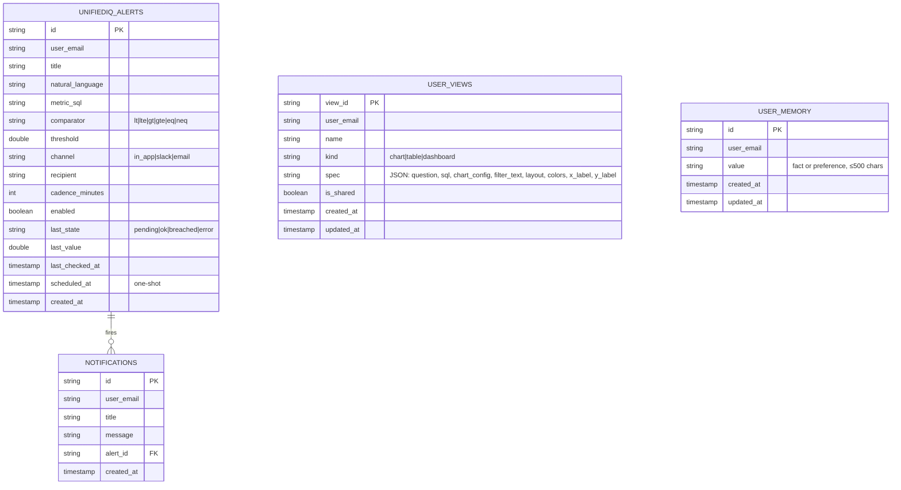
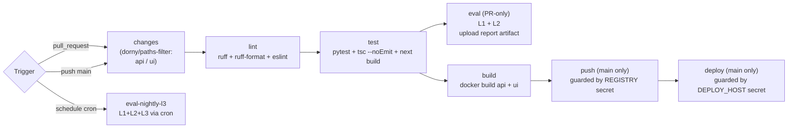

# Architecture

UnifiedIQ is a single-process conversational-BI application: a FastAPI
backend that talks to a Databricks SQL warehouse and the Databricks
Foundation Model API, fronted by a Next.js static SPA that the same backend
serves. The browser talks only to `/api/*` on the same origin — there is
no separate BFF or Node server.

This document describes the runtime topology, the layout of the codebase,
and the cross-cutting concerns (auth, LLM, streaming, persistence, eval,
CI). For feature-level walkthroughs see
[ConversationalBI.md](ConversationalBI.md) and
[Dashboard.md](Dashboard.md).

The system context diagram below is a hand-authored SVG (the three-column
"user devices / application layer / external services" style). All the
technical-flow diagrams further down use [Mermaid](https://mermaid.js.org/).
Both render natively on GitHub and inside VS Code's preview.

## 1. System context

The browser is the only client; identity is terminated by the Databricks
Apps platform; the FastAPI process is the only thing that talks to the
warehouse and the foundation models.



Two deployment shapes are supported, both built from the same source:

- **Databricks App (production)** — the diagram above. One Python process
  serves both `/api/*` and the SPA from `src/UnifiedIQ-api/static/`.
- **Local two-tier (Docker Compose)** — Next.js dev server on `:3000`,
  FastAPI on `:5000`, optional Postgres on `:5432`. Auth via
  `AUTH_BYPASS=true` or Okta OIDC. Same Python services and SPA build; only
  the hosting boundary differs.

## 2. Backend

Stack: Python 3.12, FastAPI + Uvicorn, Pydantic v2, `openai` (pointed at
Databricks FM API), `instructor` for structured outputs (MD_JSON mode),
`sqlglot` (dialect `databricks`) for SQL validation,
`databricks-sql-connector` for warehouse I/O, `httpx`, `pyjwt[crypto]` for
OIDC.

### Layers

```mermaid
flowchart TB
    subgraph Routers["FastAPI routers"]
      direction LR
      RH["health.py<br/>/api/health /api/me"]
      RC["chat.py<br/>/api/chat<br/>/api/chat/stream (SSE)"]
      RVf["verify.py<br/>/api/chat/verify"]
      RA["alerts.py<br/>/api/alerts<br/>/api/notifications"]
      RV["views.py<br/>/api/views (CRUD + PATCH + /run)"]
      RM["memory.py<br/>/api/memory"]
      RI["integrations.py<br/>/api/integrations"]
    end

    subgraph Services
      direction LR
      SLLM["LLMService<br/>(instructor MD_JSON)"]
      SWH["WarehouseService<br/>(DatabricksWarehouse)"]
      SSchema["SchemaService<br/>(Memory · Tier 1)"]
      SUM["UserMemoryService<br/>(Memory · Tier 4)"]
      SVer["VerifierService<br/>(self-audit + LLM judge)"]
      SAlerts["AlertService<br/>+ AlertScheduler"]
      SViews["ViewsService"]
      SAuth["UserAuth / ServiceAuth"]
      SReg["IntegrationRegistry"]
      SSess["SessionStore<br/>+ async-queue worker"]
      STel["TelemetryLogger<br/>+ async-queue worker"]
      SCache["CacheService<br/>(TTLCache)"]
    end

    subgraph Integrations
      direction LR
      ISlack["SlackIntegration"]
      IEmail["EmailIntegration (SMTP)"]
      IInApp["InAppIntegration<br/>(ring buffer)"]
    end

    Models["Pydantic models<br/>(domain / requests / responses)"]
    Prompts["Prompts<br/>(chat_system, alert_system,<br/>verifier_system, judge_system)"]
    Errors["AppError<br/>+ stable codes"]

    RC --> SLLM
    RC --> SWH
    RC --> SSess
    RC --> STel
    RC -.injects.-> SSchema
    RC -.injects.-> SUM
    RVf --> SVer
    RA --> SLLM
    RA --> SAlerts
    RV --> SViews
    RM --> SUM
    RI --> SReg

    SAlerts --> SWH
    SAlerts --> SReg
    SViews --> SWH
    SSchema --> SWH
    SUM --> SWH
    SVer --> SLLM
    SVer --> SWH

    SReg --> ISlack
    SReg --> IEmail
    SReg --> IInApp

    SLLM -.uses.-> Prompts
    SLLM -.validates with.-> Models
    Routers -.raises.-> Errors

    SLLM -->|OpenAI HTTP| FM["Databricks FM API"]
    SWH -->|Thrift| WHs["Databricks SQL"]
    SAlerts -->|metric_sql + state writes| WHs
    SViews -->|saved sql + spec writes| WHs
    SSchema -->|information_schema reads| WHs
    SUM -->|user_memory writes| WHs
```



Source layout:

```
src/UnifiedIQ-api/app/
  main.py             FastAPI app + lifespan + CORS + exception handlers
                      + StaticFiles mount for the prebuilt UI
  config.py           Settings (BaseSettings) - all env vars in one class
  deps.py             AppState dataclass + FastAPI Depends helpers
  errors.py           Stable error codes + AppError type
  observability.py    JSON log formatter + OTel hook
  sse.py              SSE serializer with the fixed event vocabulary
  workers/            Lifespan start/stop hooks (sessions, telemetry, scheduler)

  routers/            health, chat, verify, integrations, alerts, views, memory
  services/           llm, warehouse, cache, auth, session_store, telemetry,
                      integration_registry, alerts, views, verifier, schema,
                      user_memory
  integrations/       base, slack, email_smtp, in_app
  models/             domain, requests, responses
  prompts/            chat_system, alert_system, verifier_system, judge_system

  catalog/ddl/        Generic + Databricks-flavored DDL
  eval/               Layered eval harness (L1-L4) + golden set + HTML report
```

Lifespan (`app/main.py`) does the wiring on startup: build `AppState`,
register concrete integrations (`Slack`, `Email`, `InApp`), ensure the
`unifiediq_alerts`, `user_views`, and `user_memory` Delta tables exist
(`CREATE TABLE IF NOT EXISTS` + idempotent `ALTER TABLE ADD COLUMNS`),
start background workers, and mount the static UI bundle if present.

## 3. Frontend

Stack: Next.js 15 (App Router, static export), React 19, TypeScript strict,
Tailwind CSS 4, Recharts, react-markdown + remark-gfm, lucide-react. No
Node server: the UI is built with `output: "export"` and FastAPI serves the
generated `out/` directory.



The `ConversationContext` keeps a list of `ChatSession`s and one
`activeSessionId`, persisted under `unifiediq:sessions:{user_email}`
in `localStorage`. Each session has its own `turns[]`, auto-derived
title, and timestamps; the sidebar's *Recent chats* list lets the user
switch between them and previous chats survive *New chat*. A one-time
migration imports legacy single-thread storage so existing users don't
lose their last conversation.

## 4. Key flows

### 4.1 Streaming chat (`POST /api/chat/stream`)

The fixed SSE vocabulary is `thinking` / `sql` / `chart` / `data` /
`citation` / `done` / `error`. Streams always terminate with `done` or
`error` — never half-open.



### 4.2 Alert lifecycle (NL → scheduled fire)



### 4.3 Pin to dashboard



### 4.4 Self-audit (`POST /api/chat/verify`)



## 5. Cross-cutting concerns

### 5.1 Structured outputs

Every LLM call that drives application logic returns a validated Pydantic
model. `LLMService.chat_structured` patches the OpenAI client through
`instructor` in `Mode.MD_JSON` (fenced JSON, no
`response_format=json_object`). Databricks serving endpoints reject
`json_object` mode for these models, and reasoning models (`gpt-oss-*`)
return a parts list for `message.content` that breaks structured parsing.
The default model is `databricks-meta-llama-3-3-70b-instruct`, configurable
per environment.

### 5.2 Authentication

Three modes selected by `AUTH_MODE`, with `AUTH_BYPASS` as a local-only
escape hatch:



### 5.3 Persistence

Three Databricks Delta tables in `<WAREHOUSE_CATALOG>.<WAREHOUSE_SCHEMA>`
(`workspace.default` in this deployment): `unifiediq_alerts`,
`user_views`, and `user_memory`. `chatbot_history`, `chatbot_sessions`,
and `eval_results` have DDL on disk but are not yet wired (the dev sinks
are in-memory). Chat session lists are stored client-side in
`localStorage` for now — see [memory_strategy.md](memory_strategy.md)
for the plan.



`ensure_table` runs on startup and includes an idempotent
`ALTER TABLE ... ADD COLUMNS` so additive column changes (e.g.
`scheduled_at`) migrate existing tables on next deploy. `Notification` is
in-process only (the bell's ring buffer); it is not persisted, but the
`alert_id` link is what enables auto-clearing of stale notifications when
an alert is deleted.

### 5.4 Async workers

All three workers run in-process; there is no external scheduler.

- `SessionStore` and `TelemetryLogger` use `asyncio.Queue` with batched
  flush every N items or T seconds (`worker_flush_max_items`,
  `worker_flush_interval_seconds`).
- `AlertScheduler` wakes every `ALERTS_POLL_INTERVAL_SECONDS` (default
  300) and calls `AlertService.evaluate_due()`. It maintains an in-process
  active-alert count: when zero, it **skips** the warehouse poll so the
  SQL warehouse can auto-suspend — no compute cost while idle.

### 5.5 Error model

`AppError(HTTPException)` carries a stable string code. Global handlers in
`app/main.py` translate `AppError` and `RequestValidationError` into a
consistent `{code, message, request_id}` shape. Streaming endpoints always
end with a terminal `error` SSE event on failure — never a half-open
stream.

Stable codes: `LLM_UNAVAILABLE`, `LLM_INVALID_OUTPUT`, `SQL_INVALID`,
`WAREHOUSE_TIMEOUT`, `WAREHOUSE_ERROR`, `INTEGRATION_NOT_FOUND`,
`INTEGRATION_ERROR`, `UNAUTHENTICATED`, `FORBIDDEN`, `BAD_REQUEST`,
`INTERNAL`.

### 5.6 Memory layers

The full plan and per-tier status live in
[memory_strategy.md](memory_strategy.md). What's wired today:

- **Tier 1 — schema grounding** (`SchemaService`): queries
  `<catalog>.information_schema.columns` for each `SCHEMA_SOURCES` entry,
  keyword-ranks the tables against the question, and renders an
  `"## Available tables"` block that the chat router prepends to the
  planner system prompt. Bounded by `SCHEMA_MAX_TABLES_INJECTED`, cached
  for `SCHEMA_TTL_SECONDS`. Failures are caught — chat still works if
  `information_schema` is unavailable.
- **Tier 4 — user memory** (`UserMemoryService` +
  `<schema>.user_memory` Delta table): persistent per-user facts. The
  chat router also renders these as an `"## User context"` bullet list
  in the system prompt. Managed by the sidebar Memory panel
  (`GET/POST/DELETE /api/memory`).

Tiers 2 (result cache), 3 (rolling summary), and 5 (episodic recall via
Vector Search) are planned; see `memory_strategy.md` for design.

### 5.7 Self-audit (verifier)

`VerifierService` (see §4.4) is the runtime "BI tools don't admit
uncertainty" feature: it asks the LLM for a *structurally different*
alternative SQL (`AlternativeSQLResponse`), runs both queries, and
either compares scalars within tolerance bands (1% / 5% / 20%) or
falls back to `llm_judge` (`JudgeScore` over the two result sets). The
same `llm_judge()` function is exported so the eval harness's L4 layer
can reuse it.

## 6. Evaluation framework

`src/UnifiedIQ-api/eval/` ships a layered harness:

| Layer | Check                                                            |
|-------|------------------------------------------------------------------|
| L1    | `sqlglot.transpile(dialect="databricks")` parses the SQL         |
| L2    | Intent / required + forbidden regex / expected columns / chart   |
| L3    | Execution parity: generated vs expected SQL row counts (opt-in)  |
| L4    | Stubbed LLM-as-judge                                             |

`run_eval.py --golden eval/golden_test_set.json [--run-l3] [--write-report]`
emits `results/<git-sha>-<ts>.json` (matching the `eval_results` schema)
and, with `--write-report`, an inline-CSS HTML report (scorecard,
failure-tag histogram, per-case diffs).

## 7. CI/CD

`.github/workflows/ci.yml` uses path-based change detection
(`dorny/paths-filter`) and runs the standard pipeline. `push` and `deploy`
jobs are guarded by secret presence — a fresh clone has a green pipeline
without infra credentials.



## 8. Configuration

All backend settings live in `app/config.py` as a single
`Settings(BaseSettings)`. Every variable read by code appears in
`src/UnifiedIQ-api/.env.example`. Key groups: app, LLM (Databricks FM API),
warehouse (Databricks SQL), vector store, OIDC auth, service principal,
cache, workers, alerts, Slack, SMTP. The frontend has one client variable
(`NEXT_PUBLIC_APP_NAME`) in `products/UnifiedIQ-ui/.env.example`.

For Databricks deployment,
[`src/UnifiedIQ-api/app.yaml`](src/UnifiedIQ-api/app.yaml) declares the
`command` (uvicorn binding to `$DATABRICKS_APP_PORT`), non-secret env
values, and `valueFrom` references to secret-scope keys. Secrets are kept
out of source via the `unifiediq` Databricks secret scope.
